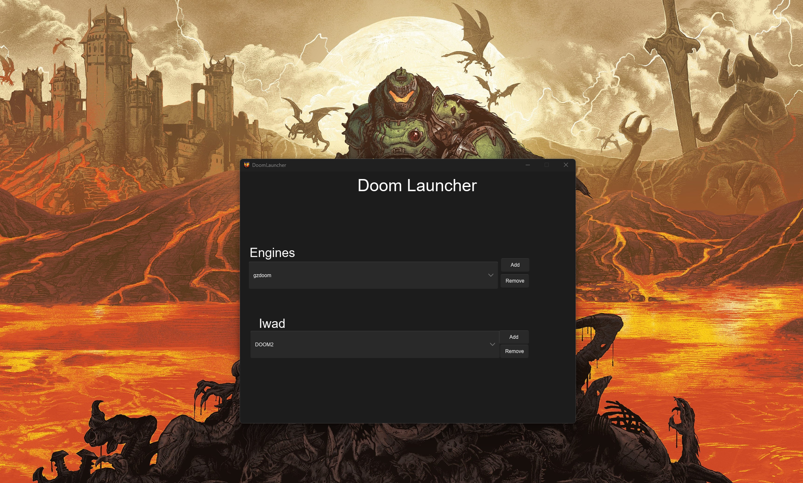
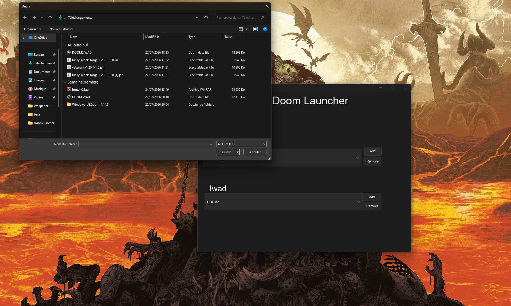
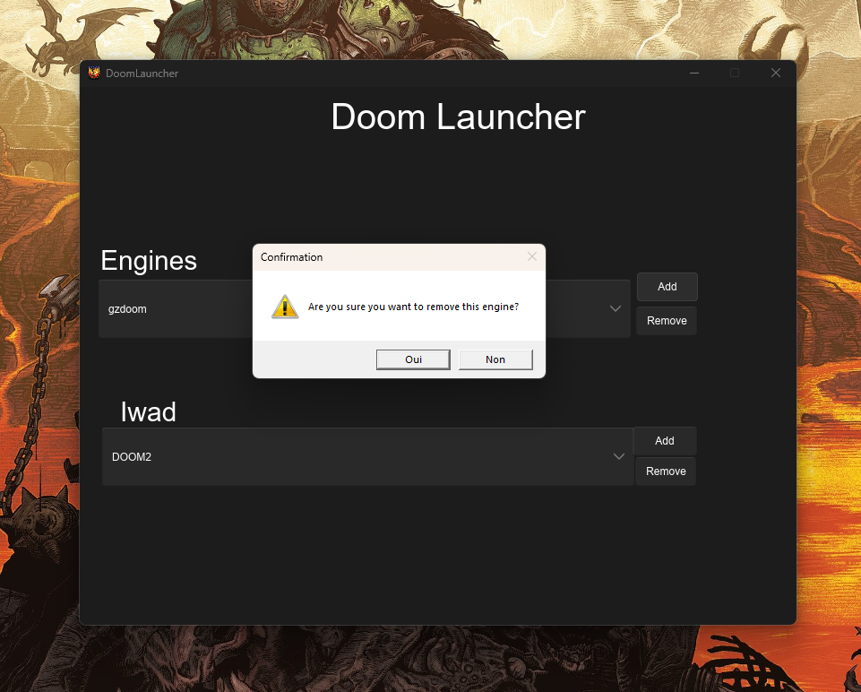

# InSightLauncher
A simple launcher written in Rust and Slint to easily manage your Doom engines, IWADs, and mods.




<br>


### Features

* Launch of rendering engines
* Management and selection of IWADs
* Saving configuration in TOML format
* Compatible with Windows and Linux *(maybe macOS, but I'm too poor to test!)*

### Build & Run

```bash
# Clone the repository
git clone https://github.com/Antidino72/DoomLauncher.git

# Run in dev mode 
cargo run

# Compile final release
cargo build --release
```
### 🗓️ Upcoming Features (Roadmap)

- [ ] **Profiles System**: Save and load custom configurations for different setups
- [ ] **Mod Management**: Full support for `.wad` and `.pk3` files
- [ ] **Doomseeker Integration**: Easily launch and connect to online multiplayer servers
- [ ] **Auto-Detection**: Automatically search and locate engine executables on your system
- [ ] **1-Click Mod Installation**: Simple and fast mod setup


### 📜 License
Distributed under the CC-BY-SA-4.0 License. See `LICENSE` for more information.